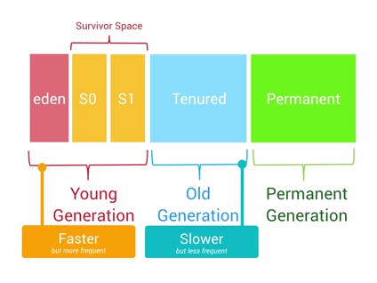

# 安卓性能优化

## 性能优化的几大考虑
+  Mobile Context
  +  资源受限
    +  内存，普遍较小，512MB很常见，开发者的机器一般比用户的机器高端
    +  CPU，核心少，运算能力没有全开
    +  GPU，上传大的纹理（texture），overdraw
  +  内存开销大，会导致系统换入换出更频繁，GC更频繁，APP被kill、被重启更频繁，不仅会消耗更多电量，而且GC会消耗大量时间，使得应用程序渲染速度低于60fps（GC耗时dalvik 10-20ms，ART 2-3ms）
  +  外部存储与网络，也是受限的，需要考虑资源的使用、网络请求的优化
+  The Rules: Memory
  +  Avoid Allocations in Inner Loops
  +  Avoid Allocations When Possible
    +  Cached objects
  	+  Object pools：注意线程安全问题
  	+  ArrayList v.s. 数组
  	+  Android collections classes：HashMap v.s. ArrayMap/SimpleArrayMap
  	+  Methods with mutated objects
  	+  Avoid object types when primitive types will do：SparseIntArray，SparseLongArray
  	+  Avoid arrays of objects
  +  Avoid Iterators：显式与隐式（foreach语句），会导致一个Iterator的分配，即便是空集合。
  +  Avoid Enums
  +  Avoid Frameworks and Libraries Not Written for Mobile Applications
  +  Avoid Static Leaks
  +  Avoid Finalizers
  +  Avoid Excess Static Initialization
  +  Trim caches on demand
  +  Use isLowRamDevice：ActivityManager.isLowRamDevice()
  +  Avoid Requesting a Large Heap
  +  Avoid Running Services Longer than Necessary：BroadcastReceiver，IntentService
  +  Optimize for Code Size
    +  Use Proguard to strip out unused code
    +  Carefully consider your library dependencies
    +  Make sure to understand the cost of any code which is automatically generated
    +  Prefer simple, direct solutions to problems rather than creating a lot of infrastructure and abstractions to solve those problems
+  The Rules: Performance
  +  Avoid Expensive Operations During Animations and User Interaction
  动画的每一帧渲染都是在UI线程的，如果有动画的时候进行耗时操作，很可能导致动画不流畅，耗时操作包括：
    +  Layout：当动画正在播放的时候，要避免改变View（延迟改变）；同时选择动画也需要避免会触发layout的动画，例如translationX，translationY只会导致延迟的layout操作，而LayoutParams属性，则会导致即时的layout。
    +  Inflation：动画过程中避免inflate新的view，比如启动新的activity，或者ListView滑动到不同type的区域。
  +  Launch Fast
    +  Avoid this problem by launching as fast as possible
    +  Also, avoid initialization code in your Application object
  +  Avoid Complex View Hierarchies
    +  One approach to avoiding complex nested hierarchies is to use custom views or custom layouts in some situations; it may be cheaper for a single view to draw several pieces of text and icons rather than have a series of nested ViewGroups to accomplish this.
    +  结合的准则就是根据他们是否需要单独和用户完成交互（响应点击事件等）
  +  Avoid RelativeLayout Near the Top of the View Hierarchy
  RelativeLayout需要两次measurement passes才能确定布局正确，嵌套RelativeLayout，是幂乘关系
  +  Avoid Expensive Operations on the UI Thread
  +  Minimize Wakeups
  +  Develop for the Low End
  +  Measure Performance
+  The Rules: Networking
  +  Don’t Over-Sync：batch it up with other system requests with JobScheduler or GCM Network Manager.
  +  Avoid Overloading the Server
  +  Don’t Make Assumptions about the Network
  +  Develop for Low End Networks
  +  Design Back-End APIs to Suit Client Usage Patterns：相关数据一个请求分发完毕；不相关的数据分接口分发；客户端应对获取的数据具备足够的信息；
+  The Rules: Language and Libraries
  +  Use Android-Appropriate Data Structures: ArrayMap, SparseArray
  +  Serialization
    +  Parcelable：安卓系统IPC格式；把Parcel写到磁盘是不安全的；解包方必须能访问Parcel的类，否则将失败；特定的类（Bitmap，CursorWindow）将被写到SharedPreference中，而通过Parcel传递的只是文件的fd，存在性能优化的空间，但是也节约了内存；
    +  Persistable Bundles：API 21引入，序列化为XML，支持的类型比Parcel少，但是为Bundle子类，某些场景方便处理；
    +  Avoid Java Serialization：额外开销更大，性能更差
    +  XML and JSON：效率更低，复杂数据应考虑前述选项
  +  Avoid JNI
    +  需要考虑多种处理器架构，指针用long保存
    +  java->jni, jni->java调用开销都很大，一次JNI调用做尽可能多的工作
    +  内存管理，java对象管理jni对应对象的生命周期
    +  错误处理，在调用JNI之前检查参数
    +  参数对象尽量“传值”调用，即：展开后传递，不要在JNI里面使用指针访问成员，避免JNI过程中对象被回收
  +  Prefer Primitive Types：内存、性能
+  The Rules: Storage
  +  Avoid Hard-coded File Paths
  +  Persist Relative Paths Only
  +  Use Storage Cache for Temporary Files
  +  Avoid SQLite for Simple Requirements
  +  Avoid Using Too Many Databases
  +  Let User Choose Content Storage Location
+  The Rules: Framework
  +  Avoid Architecting Around Application Components
  +  Services Should Be Bound or Started, Not Both
  +  Prefer Broadcast over Service for Independent Events：Use broadcasts for delivering independent events; use services for processes with state and on-going lifecycle.
  +  Avoid Passing Large Objects Through Binder
  +  Isolate UI processes from Background Services
+  The Rules: User Interface
  +  Avoid Overdraw
  +  Avoid Null Window Backgrounds
  put the background drawable you want on the window itself with the windowBackground theme attribute and let those intervening containers keep their default transparent backgrounds.
  +  Avoid Disabling the Starting Window（windowDisablePreview/windowBackground）
  +  Allow Easy Exit from Immersive Mode
  +  Set Correct Status/Navigation Bar Colors in Starting Window
  +  Use the Appropriate Context
  +  Avoid View-Related References in Asynchronous Callbacks
  +  Design for RTL
  +  Cache Data Locally
  +  Cache User Input Locally
  +  Separate Network and Disk Background Operations
+  Tools
  +  Host Tools
    +  Systrace
    +  AllocationTracker
    +  Traceview
    +  Hierarchyviewer
    +  MAT (Memory Analysis Tool)
    +  Memory Monitor
    +  meminfo
  +  On-device tools
    +  StrictMode
    +  Profile GPU rendering
    +  Debug GPU overdraw
    +  Animator duration scale
    +  Screenrecord
    +  Show hardware layer updates

## 谷歌安卓团队对于性能优化的建议
+  [Android performance patterns系列视频](https://www.youtube.com/playlist?list=PLWz5rJ2EKKc9CBxr3BVjPTPoDPLdPIFCE)已经出到了第三季，国内也有安卓大神整理翻译的[中文文字版](http://hukai.me/android-performance-patterns/)，但就像读书一样，大神写了完整的书，看的时候还是要做个笔记的。以下只是针对自身情况的笔记，仅供参考。
+  S1E0: Render Performance
  +  60 fps, 16 ms每帧
+  S1E1: Understanding Overdraw
  +  开发者选项：Show GPU Overdraw
  +  避免设置多重背景
+  S1E2: Understanding VSYNC
  +  Refresh Rate：代表了屏幕在一秒内刷新屏幕的次数，这取决于硬件的固定参数，例如60Hz
  +  Frame Rate：代表了GPU在一秒内绘制操作的帧数，例如30fps，60fps
  +  当Refresh rate和Frame rate不一致时，将会发生tearing效果：屏幕的内容被分成了上下两部分，分别来自两帧的内容
    +  原理简述：视频（动画）是由静态帧快速切换达到的效果（例如60 fps），而每帧是一个图片，其内容就是一个像素矩阵，显示屏绘制每帧的时候，是逐行绘制该像素矩阵的，理想情况下，显示屏绘制完一帧的像素之后，去获取下一帧的像素进行绘制，但如果显示屏绘制第一帧的像素绘制到一半，保存帧像素矩阵的buffer被写入了第二帧的像素矩阵，而显示屏并不知道，仍会接着从上一行往下绘制，就会导致绘制出来的图像上部分属于上一帧，下部分属于下一帧，即tearing效果。
  +  VSync，用来同步GPU和屏幕绘制，在GPU载入新帧之前，要等待屏幕绘制完成上一帧的数据
    +  还有更多关于图像渲染的内容，三重缓冲等，需要扩展阅读
  +  帧率大于刷新频率（60 fps）时，显示很流畅；帧率小于60 fps时，会显示重复帧；帧率突然从大于60 fps降到低于60 fps时，用户就会感受到卡顿的发生了；
+  S1E3: Tool: Profile GPU Rendering
  +  开发者选项：Profile GPU Rendering, On screen as bars
  +  两个区域（虚拟键盘设备会有三个区域），从上到下分别表示：状态栏绘制、主窗口绘制、虚拟键盘区域绘制
  +  三种颜色
    +  蓝色：draw time，创建、更新display list所消耗的时间；onDraw函数中使用Canvas调用的draw*函数的执行时间；convert to GPU description, cache as display list；
      +  蓝色过高，可能因为大量view被invalidate，需要重绘，或者是onDraw方法的逻辑过于复杂，执行时间长
    +  红色：execute time，Android 2D renderer执行display list所消耗的时间（通过Open GL接口，使用GPU绘制）；自定义View越复杂，GPU渲染所需时间越长；
      +  红色过高，原因很可能就是View的构成太复杂；极高的峰值，可能是因为重新提交了视图绘制造成的，并非view被invalidate，而是类似于View旋转这样的变化，需要先清空原有区域，再重新绘制；
    +  橙色：process time，CPU通知GPU渲染结束消耗的时间，同步调用
      +  橙色过高，可能是View太复杂，渲染需要太多时间
+  S1E4: Why 60fps? 常识，12 fps近乎于人手快速翻书，24 fps是电影的常用帧率，60 fps用于表现绚丽的动画效果
+  S1E5: Android, UI and the GPU
  +  Resterization（栅格化）：绘制Button，Shape，Path，Text，Bitmap等组件最基础的操作；栅格化就是将这些组件的内容拆分到不同的像素上进行显示；栅格化很耗时，引入GPU就是为了加快栅格化操作；
  +  CPU负责把UI组件计算成Polygons，Texture纹理，然后交给GPU进行栅格化渲染
  +  因此需要在CPU和GPU之间传递数据，OpenGL ES可以把那些需要渲染的纹理Hold在GPU Memory里面，在下次需要渲染的时候直接操作。如果更新了GPU所hold住的纹理内容，之前保存的状态就丢失了，将导致绘制变慢。
  +  在安卓系统中，由主题提供的资源（Bitmaps，Drawables等）都是一起打包到统一的Texture纹理当中，然后再传递到GPU里面，这意味着每次你需要使用这些资源的时候，都是直接从纹理里面进行获取渲染的，速度将会更快。
  +  也有更复杂的组件，例如显示图片的时候，需要先经过CPU的计算加载到内存中，然后传递给GPU进行渲染。文字的显示更加复杂，需要先经过CPU换算成纹理，然后再交给GPU进行渲染，回到CPU绘制单个字符的时候，再重新引用经过GPU渲染的内容。动画则是一个更加复杂的操作流程。
+  S1E6: Invalidations, Layouts, and Performance
  +  DisplayList：包含需要GPU绘制到屏幕上的数据信息
  +  在某个View第一次被渲染时，会创建DisplayList，当这个View要显示到屏幕上时，会执行GPU的绘制指令来进行渲染。如果后续有移动这个View的位置等操作而需要再次渲染这个View时，只需要额外操作一次渲染指令即可。如果修改了View中的某些可见组件，将需要进行创建DisplayList、执行渲染指令整个过程。
  +  上述步骤可简化为下图，需要的时间取决于View的复杂度，View重绘引起的View hierarchy的变化的复杂度
  
  
  +  可用工具：Profile GPU Rendering查看渲染的表现性能；Show GPU view updates查看视图更新的操作；HierarchyViewer查看界面布局结构；
  +  目标/要点：使布局扁平化，移除非必要组件，避免使用嵌套layout（尤其是根节点方向的RelativeLayout和有weight的LinearLayout）
+  S1E7: Overdraw, Cliprect, QuickReject
  +  标准组件（或其组合）的Overdraw可以使用工具来检测、消除；同时系统也会避免绘制完全不可见的组件；
  +  完全自定义组件（重写onDraw方法），上述方案将无法实现；可通过`canvas.clipRect()`来帮助系统识别可见区域，完全在矩形外面的内容（组件）将不会绘制、渲染，但有部分在矩形内的仍会绘制、渲染；
  +  `canvas.quickreject()`函数可以判断是否和某个矩形相交，如果不相交，则可以直接跳过；
  +  性能优化总原则之一：先测量效果，发现问题再寻找根源，尝试改进后要再次测量效果进行对比
+  S1E8: Memory Churn and performance
  +  Android的堆内存分代回收模型如下图示
  
  
  +  GC时会暂停所有其他线程，导致GC频繁的可能原因
    +  Memory Churn（内存抖动），大量对象被创建，然后立即被销毁，例如在onDraw等函数中创建对象
    +  瞬间产生大量的对象会严重占用Young Generation的内存区域，当达到阀值，剩余空间不够的时候，也会触发GC。同时可能触发其他区域（代）的GC
  +  使用Android studio的Memory Monitor，可以观察是否存在内存抖动，Memory monitor集成了Allocation Tracker，使用Allocation Tracker可以查看每个线程的内存分配情况，可以具体到某个函数的某行代码
  +  平常需要注意的是：onDraw等这样会被高频率反复调用的函数、循环体内部等，避免创建新对象
+  S1E9: Garbage Collection in Android
  +  安卓系统使用的虚拟机是三代模型：Young, old, permanent；越往后每代GC时间越长；
  +  应该避免频繁GC
+  S1E10: Performance Cost of Memory Leaks
  +  一个典型的Activity泄露场景：Activity类内部的非静态Handler子类（或匿名类）实例
  +  LeakCanary工具是检测内存泄漏的好工具
+  S1E11: Memory Performance
  +  工具集：**Memory Monitor**：观察是否存在内存抖动；**Allocation Tracker**：追踪内存分配情况；**Heap Tool**：查看内存快照，分析可能泄露的对象；
+  S1E12: Tool - Memory Monitor，无甚可记
+  S1E13: Battery Performance
  +  尽量减少唤醒屏幕的次数与持续的时间，使用WakeLock来处理唤醒的问题，能够正确执行唤醒操作并根据设定及时关闭操作进入睡眠状态。
  +  某些非必须马上执行的操作，例如上传歌曲，图片处理等，可以等到设备处于充电状态或者电量充足的时候才进行。
  +  触发网络请求的操作，每次都会保持无线信号持续一段时间，我们可以把零散的网络请求打包进行一次操作，避免过多的无线信号引起的电量消耗。
  +  Battery Historian Tool：查看APP电量消耗情况
  +  JobScheduler API：对任务进行定时处理，例如等到手机处于充电状态，或连接到WiFi时处理任务。
+  S1E14: Understanding Battery Drain on Android
  +  使用WakeLock或者JobScheduler唤醒设备处理定时的任务之后，一定要及时让设备回到初始状态。
  +  每次唤醒无线信号进行数据传递，都会消耗很多电量，它比WiFi等操作更加的耗电
+  S1E15: Battery Drain and WakeLocks
  +  WakeLock使用非精准定时器，允许系统为不同应用的wake lock请求进行打包处理，节约电量消耗
  +  JobScheduler API还能做更多的事情，例如等到充电，或者连接上wifi时处理任务

+  [对数据集合的遍历，性能对比](https://youtu.be/R5ON3iwx78M?list=PLWz5rJ2EKKc9CBxr3BVjPTPoDPLdPIFCE)：使用iterator，简化版语法，用索引遍历；


## Square团队的建议
+  [Eliminating Code Overhead by Jake Wharton](https://www.youtube.com/watch?v=b6zKBZcg5fk&feature=youtu.be)
  +  CPU
    +  Do not nest multi-pass layouts: RelativeLayout, LinearLayout with layout_weight...
    +  Lazily compute complex data when needed
    +  Cache heavy computational results for re-use
    +  Consider RenderScript for performance
    +  Keep work off main thread
  +  Memory
    +  Use object pools and caches to reduce churn (judiciously)
    +  Be mindful of the overhead of enums
    +  Do not allocate inside the draw path
    +  Use specialized collections instead of JDK collections when appropriate (SparceArray...)
  +  I/O
    +  Batch operations with reasonable back-off policies
    +  Use gzip or binary serialization format
    +  Cache data offline with TTLs for reloading
    +  Use JobScheduler API to batch across OS
  +  Spectrum of optimizations, not binary
  +  Do not blindly apply to everything, only appropriate
  +  Multiple micro-optimizations can improve like macro
  +  ArrayList分配：会有一个默认初始值，以后空间不够时按倍增策略进行扩展
    +  如果创建时就知道其大小，则可以new一个已知容量的ArrayList，避免后面扩容、数据复制的成本
    +
  +  StringBuilder：同样的，也可以先给一个预估的大小，然后直接初始化该大小的StringBuilder；安卓开发build时会自动把String的拼接操作转化为StringBuilder实现，然而这种自动的转换未必高效；
    +  例子
    ```java
      for (int x = 0; x < valueCount; x++) {
          cleanFiles[x] = new File(directory, key + "." + x);
          dirtyFiles[x] = new File(directory, key + "." + x + ".tmp");
      }
    ```
    ===>>>
    ```java
      StringBuilder b = new StringBuilder(key).append(".");
      int truncateTo = b.length();
      for (int x = 0; x < valueCount; x++) {
          b.append(x);
          cleanFiles[x] = new File(directory, b.toString());
          b.append(".tmp");
          dirtyFiles[x] = new File(directory, b.toString());
          b.setLength(truncateTo);
      }
    ```
  +  其他
    +  对函数的调用（尤其是虚函数、接口函数）结果，如果同一个作用域中有多次调用，且结果确定不变，应该将他们转化为一次调用：`for (int i = 0, size = list.size(); i < size; i++)`
    +  对集合的遍历，不要使用语法糖，会有额外开销（Iterator创建、虚函数调用等）

## [NimbleDroid的建议](http://blog.nimbledroid.com/2015/09/17/how-to-make-your-application-fluid.html)
+  性能优化的流程

+  Recommendation 1: limit app startup to 2 seconds
+  Recommendation 2: eliminate hung methods
+  Recommendation 3: measure as often as you can，怎么、什么粒度的profiling呢？
+  Recommendation 4: know a set of common issues
  +  ClassLoader.getResourceAsStream()
+  Recommendation 5: avoid surprises in 3rd-party SDKs
