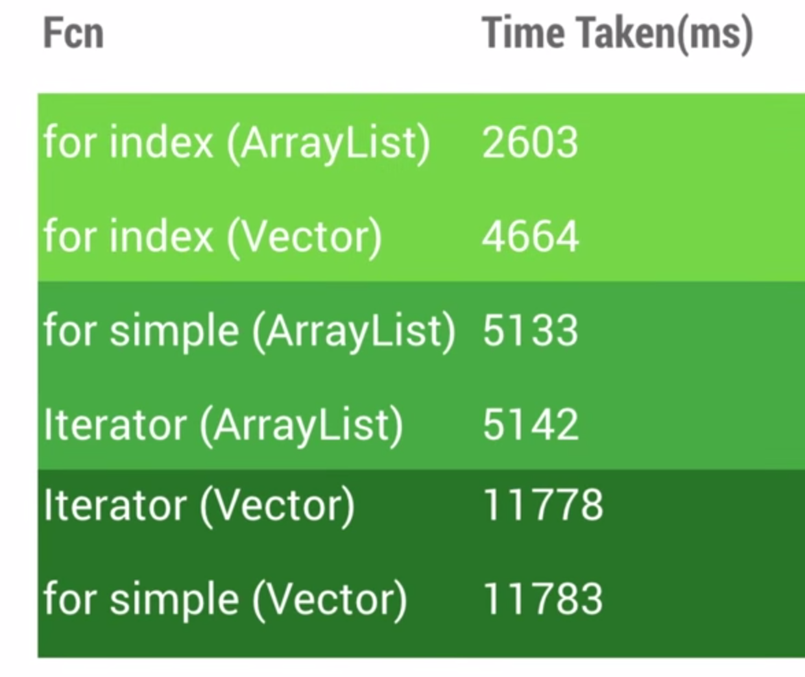

#安卓性能优化

##内存泄漏
+  Java的非静态内部类、匿名类，会持有外部类的强引用，静态的不会持有；对于Activity/Fragment内定义的Handler/Runnable，是最容易因此导致内存泄漏的，因为它们可能会postDelayed，从而导致Activity/Fragment及其内部的资源无法GC；推荐做法是定义静态内部类/静态匿名成员，访问外部类的成员和方法通过WeakRefrence实现；
+  WeakRefrence需要在内部类内创建才符合其语义？

##谷歌安卓团队对于性能优化的建议

+  [对数据集合的遍历，性能对比](https://youtu.be/R5ON3iwx78M?list=PLWz5rJ2EKKc9CBxr3BVjPTPoDPLdPIFCE)：使用iterator，简化版语法，用索引遍历；
