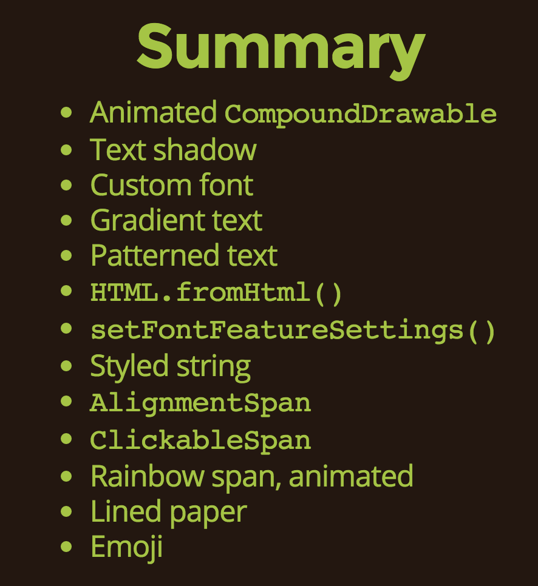

#一些很棒的点子

##系统API
+  自Android 5.0之后，用户的“最近任务”（recent tasks）视图，可以自定义了，支持自定义图标、标题、顶栏色彩；参考：[developers](https://developer.android.com/guide/components/recents.html)，[blog](https://www.bignerdranch.com/blog/polishing-your-Android-overview-screen-entry/?utm_source=Android+Weekly&utm_campaign=22c3800806-Android_Weekly_130&utm_medium=email&utm_term=0_4eb677ad19-22c3800806-337892465)；
+  全新的Android编译系统：[Jack & Jill](http://tools.android.com/tech-docs/jackandjill)
+  [使用LinearLayout的divider属性，设置为shape drawable，控制其子元素之间的间距](http://cyrilmottier.com/2014/11/17/grid-spacing-on-android/?utm_source=Android+Weekly&utm_campaign=22c3800806-Android_Weekly_130&utm_medium=email&utm_term=0_4eb677ad19-22c3800806-337892465)
+  使用wedget，在桌面上显示内容。[示例](http://ptrprograms.blogspot.com/2014/11/building-widget-to-silence-phone.html?utm_source=Android+Weekly&utm_campaign=22c3800806-Android_Weekly_130&utm_medium=email&utm_term=0_4eb677ad19-22c3800806-337892465)
+  [Android 5.0引入TextView的CSS样式fontFeatureSettings](http://blog.sqisland.com/2014/11/android-stacked-fractions.html?utm_source=Android+Weekly&utm_campaign=22c3800806-Android_Weekly_130&utm_medium=email&utm_term=0_4eb677ad19-22c3800806-337892465)
+  [利用Action Intent尽可能利用用户手机上已有的APP功能，还不需要相关的权限](http://ryanharter.com/blog/2014/11/26/whats-your-intent/?utm_source=Android+Weekly&utm_campaign=22c3800806-Android_Weekly_130&utm_medium=email&utm_term=0_4eb677ad19-22c3800806-337892465)
+  [TextView的高级玩法：CompoundDrawable，shadow，Typeface自定义字体，Shader，HTML渲染（支持自定义tag）、Span（SpannableString：字符级别、段落级别、对其），自定义Span（立式分数、彩虹效果、彩虹动效、可点击URL、Emoji...）](http://chiuki.github.io/advanced-android-textview/)，[用xml定义drawable动画](http://chiuki.github.io/advanced-android-textview/#/3)
	
+  [Shape Drawable：形状、圆角、边框、填充、渐变色填充等](http://trinea.iteye.com/blog/1483949)
+  [View绘制时加上特效：Shader，图像渲染、线性渐变、环形渐变、扫描渐变、组合渐变](http://blog.csdn.net/ldj299/article/details/6166071)
+  [安卓系统的“售货亭模式”](http://cases.azoft.com/android-kiosk-mode-rules-restrictions/)
  +  只允许用户在一个应用程序内使用，不能接收到系统通知，状态栏，退出程序，类似于ATM机，只能使用一个应用程序。
  +  5.0：设置菜单内Screen pinning mode；`startLockTask()`；
  +  pre 5.0：
    +  自启动：监听启动事件`android.intent.action.BOOT_COMPLETED`，随系统启动APP；
	+  监听返回键，并且不返回；
	+  manifest文件启动activity添加三个category：`android.intent.category.HOME`、`android.intent.category.LAUNCHER`、`android.intent.category.DEFAULT`；
	+  电源键：只在4.0以下的系统可以达到效果  
	```java
	@Override  
	public void onAttachedToWindow() {  
	    getWindow().addFlags(  
	        WindowManager.LayoutParams.FLAG_DISMISS_KEYGUARD);  
	    getWindow().addFlags(  
	        WindowManager.LayoutParams.FLAG_SHOW_WHEN_LOCKED);  
	}
	```
	+  系统对话框：监听失去焦点事件，然后发广播关掉所有系统对话框  
	```java
	@Override  
	public void onWindowFocusChanged(boolean hasFocus) {  
	  super.onWindowFocusChanged(hasFocus);  
	  if(!hasFocus) {  
	    Intent closeDialog =   
	          new Intent(Intent.ACTION_CLOSE_SYSTEM_DIALOGS);  
	    sendBroadcast(closeDialog);  
	  }  
	}  
	```
	+  虚拟键盘
	+  状态栏：全屏、TYPE_SYSTEM_ALERT、截取状态栏区域的点击事件
+  onResumeFragments
  +  FragmentActivity的子类（AppCompatActivity等）均有此lifecycle方法
  +  Activity的onResume函数调用的时候，Fragment并不能保证已执行onResume，仍有可能保存了savedState，而在这种情况下，是不能进行fragment的transaction的，而在onResumeFragments中则能保证不会存在这个问题
+  MultiDex  
MultiDex会导致build变慢，在Dalvik虚拟机上（未使用ART技术时），APP启动速度也会变慢，因为ClassLoader要从第二个（甚至更多个）dex文件中加载类；  
有时候还会导致build过程中的dex步骤报OOM错误；新提出的Jack&Jill构建技术将解决这一问题；  
```java
UNEXPECTED TOP-LEVEL ERROR:
java.lang.OutOfMemoryError: GC overhead limit exceeded
  at com.android.dx.cf.code.ExecutionStack.copy(ExecutionStack.java:66)
  at 
  ...
```  
在build.gradle中加入以下片段即可解决：  
```groovy
android {
  // ...
  dexOptions {
    javaMaxHeapSize “2048M”
  }
}
```
+  [缩小APK包体积的Tips](http://cyrilmottier.com/2014/08/26/putting-your-apks-on-diet/)
  +  Proguard
  +  Lint
  +  不必为每种dpi打包资源文件（图标）
  +  移除第三方库中不必要的资源文件  
  ```groovy
	defaultConfig {
	    resConfigs "en", "de", "fr", "it"
	    resConfigs "nodpi", "hdpi", "xhdpi", "xxhdpi", "xxxhdpi"
	}
  ```
  +  图片压缩，9-patches
  +  Limit the number of architectures, armabi, x86 is enough
  +  Reuse whenever possible：图标如果只是颜色不同、旋转，则可以只打包一个，然后通过tint/tintMode/ColorFilter/RotateDrawable来重复利用
  +  Render in code when appropriate
  +  Going even further? Server side packaging，根据设备具体细节打包资源，但是有一定风险。
+  [使用ViewPager的同时不用Fragment作为显示的内容](https://www.bignerdranch.com/blog/viewpager-without-fragments)
+  [Notification中加入联系人信息之后，通知消息的显示将有更高的优先级](https://plus.google.com/+AndroidDevelopers/posts/7QBWvNXs2mD)

##Material design
+  [Material design中的Snackbar](https://github.com/nispok/snackbar/)，[带有Context的Toast：Crouton](https://github.com/keyboardsurfer/Crouton)

##构建/工具
+  [利用buildSrc工程和Codemodel自动生成代码](http://www.thedroidsonroids.com/blog/how-to-generate-java-sources-using-buildsrc-gradle-project)

##有意思的第三方库
+  [基于UDP组播的Intent发送和接收](http://www.androidzeitgeist.com/2014/11/introducing-android-network-intents17.html?utm_source=Android+Weekly&utm_campaign=a94f126150-Android_Weekly_129&utm_medium=email&utm_term=0_4eb677ad19-a94f126150-337892465)
+  [将SQLite操作封装为rx API](http://beust.com/weblog/2015/06/01/easy-sqlite-on-android-with-rxjava/)，封装思想值得借鉴
+  [Prism](https://blog.stylingandroid.com/prism-fundamentals-part-1)，为各种部件（View，Window，StatusBar）设置颜色、背景，API简洁，功能强大；
+  [Fontinator](https://github.com/svendvd/fontinator)，自定义字体使用帮助库
+  [Google play service条形码/二维码识别](http://android-developers.blogspot.co.uk/2015/08/barcode-detection-in-google-play.html)
+  [Google play service人脸识别](http://android-developers.blogspot.co.uk/2015/08/face-detection-in-google-play-services.html)
+  [Quick return with CoordinatorLayout](https://medium.com/@bherbst/quick-return-with-recyclerview-e70c8da9b4c1?mc_cid=5e6ec8b400&mc_eid=fb5841ce0e)
+  [Design support library demo](https://github.com/chrisbanes/cheesesquare)
+  [FlatBuffer，比JSON更高效的序列化格式](http://frogermcs.github.io/flatbuffers-in-android-introdution/)
+  [android-iconify，图标化字体应用库，支持配置大小、颜色、动效！](http://blog.joanzapata.com/iconify-just-got-a-lot-better)
+  [Favor composition over inheritance，Adapter组合复用](https://github.com/sockeqwe/AdapterDelegates)
+  [Drawble上加蒙色，减小包大小](http://andraskindler.com/blog/2015/tinting_drawables/)
+  [Google Eddystone with the Proximity Beacon API](https://medium.com/ribot-labs/exploring-google-eddystone-with-the-proximity-beacon-api-bc9256c97e05)，Beacon是一些蓝牙低能耗发射器，它们能够向附近的电子设备发射信息，提供基于附近位置的服务。

##最佳实践
+  使用[Headless Fragment](Fragments.md#使用fragment进行后台处理headless-fragment)把部分Activity公用的逻辑封装起来，避免将只被部分Activity公用的逻辑加到所有Activity的父类中。