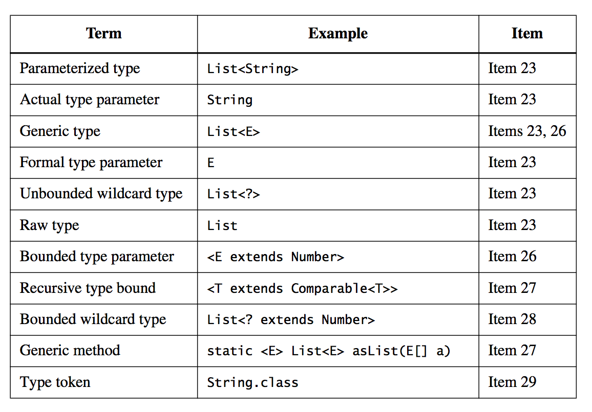

#Effective Java一书笔记

##对象的创建与销毁
+  Item 1: 使用static工厂方法，而不是构造函数创建对象  
仅仅是创建对象的方法，并非Factory Pattern
  +  优点
    +  命名、接口理解更高效，通过工厂方法的函数名，而不是参数列表来表达其语义
	+  Instance control，并非每次调用都会创建新对象，可以使用预先创建好的对象，或者做对象缓存；便于实现单例；或不可实例化的类；对于immutable的对象来说，使得用`==`判等符合语义，且更高效；
	+  工厂方法能够返回任何返回类型的子类对象，甚至是私有实现；使得开发模块之间通过接口耦合，降低耦合度；而接口的实现也将更加灵活；接口不能有static方法，通常做法是为其再创建一个工厂方法类，如Collection与Collections；
	+  Read More: Service Provider Framework
  +  缺点
    +  仅有static工厂方法，没有public/protected构造函数的类将无法被继承；见仁见智，这一方面也迫使开发者倾向于组合而非继承；
	+  Javadoc中不能和其他static方法区分开，没有构造函数的集中显示优点；但可以通过公约的命名规则来改善；
  +  小结  
  static工厂方法和public构造函数均有其优缺点，在编码过程中，可以先考虑一下工厂方法是否合适，再进行选择。
+  Item 2: 使用当构造函数的参数较多，尤其是其中还有部分是可选参数时，使用Builder模式
  +  以往的方法
    +  Telescoping constructor：针对可选参数，从0个到最多个，依次编写一个构造函数，它们按照参数数量由少到多逐层调用，最终调用到完整参数的构造函数；代码冗余，有时还得传递无意义参数，而且容易导致使用过程中出隐蔽的bug；
    +  JavaBeans Pattern：灵活，但是缺乏安全性，有状态不一致问题，线程安全问题；
  +  Builder Pattern
    +  代码灵活简洁；具备安全性；
    +  immutable
    +  参数检查：最好放在要build的对象的构造函数中，而非builder的构建过程中
    +  支持多个field以varargs的方式设置（每个函数只能有一个varargs）
    +  一个builder可以build多个对象
    +  Builder结合泛型，实现Abstract Factory Pattern
    +  传统的抽象工厂模式，是用Class类实现的，然而其有缺点：newInstance调用总是去调用无参数构造函数，不能保证存在；newInstance方法会抛出所有无参数构造函数中的异常，而且不会被编译期的异常检查机制覆盖；可能会导致运行时异常，而非编译期错误；
  +  小结  
  Builder模式在简单地类（参数较少，例如4个以下）中，优势并不明显，但是需要予以考虑，尤其是当参数可能会变多时，有可选参数时更是如此。
+  Item 3: 单例模式！  
不管以哪种形式实现单例模式，它们的核心原理都是将构造函数私有化，并且通过静态方法获取一个唯一的实例，在这个获取的过程中你必须保证线程安全、反序列化导致重新生成实例对象等问题，该模式简单，但使用率较高。
  +  double-check-locking  
    ```java
        private static volatile RestAdapter sRestAdapter = null;
        public static RestAdapter provideRestAdapter() {
            if (sRestAdapter == null) {
                synchronized (RestProvider.class) {
                    if (sRestAdapter == null) {
                        sRestAdapter = new RestAdapter();
                    }
                }
            }
    
            return sRestAdapter;
        }
    ```
  DCL可能会失效，因为指令重排可能导致同步解除后，对象初始化不完全就被其他线程获取；使用volatile关键字修饰对象，或者使用static SingletonHolder来避免该问题（后者JLS推荐）；
  +  class的static代码：一个类只有在被使用时才会初始化，而类初始化过程是非并行的，这些都由JLS能保证
  +  用enum实现单例
  +  还存在反射安全性问题：利用反射，可以访问私有方法，可通过加一个控制变量，该变量在getInstance函数中设置，如果不是从getInstance调用构造函数，则抛出异常；
+  Item 4: 将构造函数私有化，使得不能从类外创建实例，同时也能禁止类被继承  
  util类可能不希望被实例化，有其需求
+  Item 5: 避免创建不必要的对象
  +  提高性能：创建对象需要时间、空间，“重量级”对象尤甚；immutable的对象也应该避免重复创建，例如String；
  +  避免auto-boxing
  +  但是因此而故意不创建必要的对象是错误的，使用object pool通常也是没必要的
  +  lazy initialize也不是特别必要，除非使用场景很少且很重量级
  +  Map#keySet方法，每次调用返回的是同一个Set对象，如果修改了返回的set，其他使用的代码可能会产生bug
  +  需要defensive copying的时候，如果没有创建一个新对象，将导致很隐藏的Bug
+  Item 6: 不再使用的对象一定要解除引用，避免memory leak
  +  例如，用数组实现一个栈，pop的时候，如果仅仅是移动下标，没有把pop出栈的数组位置引用解除，将发生内存泄漏
  +  程序发生错误之后，应该尽快把错误抛出，而不是以错误的状态继续运行，否则可能导致更大的问题
  +  通过把变量（引用）置为null不是最好的实现方式，只有在极端情况下才需要这样；好的办法是通过作用域来使得变量的引用过期，所以尽量缩小变量的作用域是很好的实践；注意，在Dalvik虚拟机中，存在一个细微的bug，可能会导致内存泄漏，[详见](MemoryLeak.md)
  +  当一个类管理了一块内存，用于保存其他对象（数据）时，例如用数组实现的栈，底层通过一个数组来管理数据，但是数组的大小不等于有效数据的大小，GC器却并不知道这件事，所以这时候，需要对其管理的数据对象进行null解引用
  +  当一个类管理了一块内存，用于保存其他对象（数据）时，程序员应该保持高度警惕，避免出现内存泄漏，一旦数据无效之后，需要立即解除引用
  +  实现缓存的时候也很容易导致内存泄漏，放进缓存的对象一定要有换出机制，或者通过弱引用来进行引用
  +  listner和callback也有可能导致内存泄漏，最好使用弱引用来进行引用，使得其可以被GC
+  Item 7: 不要使用finalize方法
  +  finalize方法不同于C++的析构函数，不是用来释放资源的好地方
  +  finalize方法执行并不及时，其执行线程优先级很低，而当对象unreachable之后，需要执行finalize方法之后才能释放，所以会导致对象生存周期变长，甚至根本不会释放
  +  finalize方法的执行并不保证执行成功/完成
  +  使用finalize时，性能会严重下降
  +  finalize存在的意义
    +  充当“safety net”的角色，避免对象的使用者忘记调用显式termination方法，尽管finalize方法的执行时间没有保证，但是晚释放资源好过不释放资源；此处输出log警告有利于排查bug
    +  用于释放native peer，但是当native peer持有必须要释放的资源时，应该定义显式termination方法
  +  子类finalize方法并不会自动调用父类finalize方法（和构造函数不同），为了避免子类不手动调用父类的finalize方法导致父类的资源未被释放，当需要使用finalize时，使用finalizer guardian比较好：
    +  定义一个私有的匿名Object子类对象，重写其finalize方法，在其中进行父类要做的工作
    +  因为当父类对象被回收时，finalizer guardian也会被回收，它的finalize方法就一定会被触发

##Object的方法
尽管Object不是抽象类，但是其定义的非final方法设计的时候都是希望被重写的，finalize除外。
+  Item 8: 当重写equals方法时，遵循其语义
  +  能不重写equals时就不要重写
    +  当对象表达的不是值，而是可变的状态时
    +  对象不需要使用判等时
    +  父类已重写，且满足子类语义
  +  当需要判等，且继承实现无法满足语义时，需要重写（通常是“value class”，或immutable对象）
  +  当用作map的key时
  +  重写equals时需要遵循的语义
    +  Reflexive（自反性）: x.equals(x)必须返回true（x不为null）
    +  Symmetric（对称性）: x.equals(y) == y.equals(x)
    +  Transitive（传递性）: x.equals(y) && y.equals(z) ==> x.equals(z)
    +  Consistent（一致性）: 当对象未发生改变时，多次调用应该返回同一结果
    +  x.equals(null)必须返回false
  +  实现建议
    +  先用==检查是否引用同一对象，提高性能
    +  用instanceof再检查是否同一类型
    +  再强制转换为正确的类型
    +  再对各个域进行equals检查，遵循同样的规则
    +  确认其语义正确，编写测例
    +  重写equals时，同时也重写hashCode
    +  ！重写equals方法，传入的参数是Object
+  Item 9: 重写equals时也重写hashCode函数
  +  避免在基于hash的集合中使用时出错
  +  语义
    +  一致性
    +  当两个对象equals返回true时，hashCode方法的返回值也要相同
  +  hashCode的计算方式
    +  要求：equals的两个对象hashCode一样，但是不equals的对象hashCode不一样
    +  取一个素数，例如17，result = 17
    +  对每一个关心的field（在equals中参与判断的field），记为f，将其转换为一个int，记为c
      +  boolean: f ? 1 : 0
      +  byte/char/short/int: (int) f
      +  long: (int) (f ^ (f >> 32))
      +  float: Float.floatToIntBits(f)
      +  double: Double.doubleToLongBits(f)，再按照long处理
      +  Object: f == null ? 0 : f.hashCode()
      +  array: 先计算每个元素的hashCode，再按照int处理
    +  对每个field计算的c，result = 31 * result + c
    +  返回result
    +  编写测例
  +  计算hashCode时，不重要的field（未参与equals判断）不要参与计算
+  Item 10: 重写toString()方法
  +  增加可读性，简洁、可读、具有信息量
+  Item 11: 慎重重写clone方法
  +  Cloneable接口是一个mixin interface，用于表明一个对象可以被clone
  +  Contract
    +  x.clone() != x
    +  x.clone().getClass() ==  x.getClass()：要求太弱，当一个非final类重写clone方法的时候，创建的对象一定要通过super.clone()来获得，所有父类都遵循同样的原则，如此最终通过Object.clone()创建对象，能保证创建的是正确的类实例。而这一点很难保证。
    +  x.clone().equals(x)
    +  不调用构造函数：要求太强，一般都会在clone函数里面调用
  +  对于成员变量都是primitive type的类，直接调用super.clone()，然后cast为自己的类型即可（重写时允许返回被重写类返回类型的子类，便于使用方，不必每次cast）
  +  成员变量包含对象（包括primitive type数组），可以通过递归调用成员的clone方法并赋值来实现
  +  然而上述方式违背了final的使用协议，final成员不允许再次赋值，然而clone方法里面必须要对其赋值，则无法使用final保证不可变性了
  +  递归调用成员的clone方法也会存在性能问题，对HashTable递归调用深拷贝也可能导致StackOverFlow（可以通过遍历添加来避免）
  +  优雅的方式是通过super.clone()创建对象，然后为成员变量设置相同的值，而不是简单地递归调用成员的clone方法
  +  和构造函数一样，在clone的过程中，不能调用non final的方法，如果调用虚函数，那么该函数会优先执行，而此时被clone的对象状态还未完成clone/construct，会导致corruption。因此上一条中提及的“设置相同的值”所调用的方法，要是final或者private。
  +  重载类的clone方法可以省略异常表的定义，如果重写时把可见性改为public，则应该省略，便于使用；如果设计为应该被继承，则应该重写得和Object的一样，且不应该实现Cloneable接口；多线程问题也需要考虑；
  +  要实现clone方法的类，都应该实现Cloneable接口，同时把clone方法可见性设为public，返回类型为自己，应该调用super.clone()来创建对象，然后手动设置每个域的值
  +  clone方法太过复杂，如果不实现Cloneable接口，也可以通过别的方式实现copy功能，或者不提供copy功能，immutable提供copy功能是无意义的
  +  提供拷贝构造函数，或者拷贝工厂方法，而且此种方法更加推荐，但也有其不足
  +  设计用来被继承的类时，如果不实现一个正确高效的clone重写，那么其子类也将无法实现正确高效的clone功能
+  Item 12: 当对象自然有序时，实现Comparable接口
  +  实现Comparable接口可以利用其有序性特点，提高集合使用/搜索/排序的性能
  +  Contact
    +  sgn(x.compareTo(y)) == - sgn(y.compareTo(x))，当类型不对时，应该抛出ClassCastException，抛出异常的行为应该是一致的
    +  transitive: x.compareTo(y) > 0 && y.compareTo(z) > 0 ==> x.compareTo(z) > 0
    +  x.compareTo(y) == 0 ==> sgn(x.compareTo(z)) == sgn(y.compareTo(z))
    +  建议，但非必须：与equals保持一致，即 x.compareTo(y) == 0 ==> x.equals(y)，如果不一致，需要在文档中明确指出
  +  TreeSet, TreeMap等使用的就是有序保存，而HashSet, HashMap则是通过equals + hashCode保存
  +  当要为一个实现了Comparable接口的类增加成员变量时，不要通过继承来实现，而是使用组合，并提供原有对象的访问方法，以保持对Contract的遵循
  +  实现细节
    +  优先比较重要的域
    +  谨慎使用返回差值的方式，有可能会溢出

##Classes and Interfaces
+  Item 13: 最小化类、成员的可见性
  +  封装（隐藏）：公开的接口需要暴露，而接口的实现则需要隐藏，使得接口与实现解耦，降低模块耦合度，增加可测试性、稳定性、可维护性、可优化性、可修改性
  +  如果一个类只对一个类可见，则应该将其定义为私有的内部类，而没必要public的类都应该定义为package private
  +  为了便于测试，可以适当放松可见性，但也只应该改为package private，不能更高
  +  成员不能是非private的，尤其是可变的对象。一旦外部可访问，将失去对其内容的控制能力，而且会有多线程问题
  +  暴露的常量也不能是可变的对象，否则public static final也将失去其意义，final成员无法改变其指向，但其指向的对象却是可变的（immutable的对象除外），长度非0的数组同样也是有问题的，可以考虑每次访问时创建拷贝，或者使用`Collections.unmodifiableList(Arrays.asList(arr))`
+  Item 14: public class中，使用accessor method而非public field
  +  后者外部可以直接访问，失去了安全性
  +  package private或者private则可以不必这样
  +  把immutable的field置为public勉强可以接受，mutable的成员一定不能置为public
+  Item 15: 最小化可变性
  +  不提供可以改变本对象状态的方法
  +  保证类不可被继承
  +  使用final field
  +  使用private field
  +  在构造函数、accessor中，对mutable field使用defensive copy
  +  实现建议
    +  操作函数，例如BigInteger的add方法，不是static的，但也不能改变本对象的状态，则使用functional的方式，返回一个新的对象，其状态是本对象修改之后的状态
    +  如此实现的immutable对象生来就是线程安全的，无需同步操作，但应该鼓励共用实例，避免创建过多重复的对象
    +  正确实现的immutable对象也不需要clone, copy方法；可以适当引入Object cache；
  +  劣势
    +  每一个值都需要一个对象，调用改变状态的方法而创建一个新的对象，尤其是它是重量级的，开销会变大；连续调用这样的方法，影响更大；
    +  为常用的多次操作组合提供一个方法
  +  其他
    +  保证class无法被继承，除了声明为final外，还可以将默认构造函数声明为private或package private，然后提供public static工厂方法
    +  使用public static工厂方法，具体实现类可以有多个，还能进行object cache
    +  当实现Serializable接口是，一定要实现readObject/readResolve方法，或者使用ObjectOutputStream.writeUnshared/ObjectInputStream.readUnshared
  +  小结
    +  除非有很好的理由让一个Class mutable，否则应该使其immutable
    +  如果非要mutable，也应尽可能限制其可变性
+  Item 16: Favor composition (and forwarding) over inheritance
  +  跨包继承、继承不是被设计为应该被继承的实现类，是一件很危险的事情，继承接口、继承抽象类，当然是没问题的
  +  如果子类的功能依赖于父类的实现细节，那么一旦父类发生变化，子类将有可能出现Bug，即便代码都没有修改；而设计为应被继承的类，在修改后，是应该有文档说明的，子类开发者既可以得知，也可以知道如何修改
  +  例子：统计HashSet添加元素的次数
    +  用继承方式，重写add，addAll，在其中计数，这就不对，因为HashSet内部的addAll是通过调用add实现的
    +  但是通过不重写addAll也只不对的，以后有可能HashSet的实现就变了
    +  在重写中重新实现一遍父类的逻辑也是行不通的，因为这可能会导致性能问题、bug等，而且有些功能不访问私有成员也是无法实现的
    +  还有一个原因就是父类的实现中，可能会增加方法，改变其行为，而这一点，在子类中是无法控制的
  +  而通过组合的方式，将不会有这些问题，把另一个类的对象声明为私有成员，外部将无法访问它，自己也能在转发（forwarding）过程中执行拦截操作，也不必依赖其实现细节，这种组合、转发的实现被称为wrapper，或者Decorator pattern，或者delegation（严格来说不是代理，代理一般wrapper对象都需要把自己传入到被wrap的对象方法中？）
  +  缺点
    +  不适用于callback frameworks？
  +  继承应该在is-a的场景中使用
  +  继承除了会继承父类的API功能，也会继承父类的设计缺陷，而组合则可以隐藏成员类的设计缺陷
+  Item 17: Design and document for inheritance or else prohibit it
  +  一个类必须在文档中说明，每个可重写的方法，在该类的实现中的哪些地方会被调用（the class must document its self-use of overridable methods）。调用时机、顺序、结果产生的影响，包括多线程、初始化等情况。
  +  被继承类应该通过谨慎选择protected的方法或成员，来提供一些hook，用于改变其内部的行为，例如java.util.AbstractList::removeRange。
  +  The only way to test a class designed for inheritance is to write subclasses. 用于判断是否需要增加或者减少protected成员/方法，通常写3个子类就差不多了。
  +  You must test your class by writing subclasses before you release it.
  +  Constructors must not invoke overridable methods. 父类的构造函数比子类的构造函数先执行，而如果父类构造函数中调用了可重写的方法，那么就会导致子类的重写方法比子类的构造函数先执行，会导致corruption。
  +  如果实现了Serializable/Cloneable接口，neither clone nor readObject may invoke an overridable method, directly or indirectly. 重写方法会在deserialized/fix the clone’s state之前执行。
  +  如果实现了Serializable接口，readResolve/writeReplace必须是protected，而非private
  +  designing a class for inheritance places substantial limitations on the class.
  +  The best solution to this problem is to prohibit subclassing in classes that are not designed and documented to be safely subclassed. 声明为final class或者把构造函数私有化（提供public static工厂方法）。
  +  如果确实想要允许继承，就应该为每个被自己使用的可重写方法都写好文档
+  Item 18: Prefer interfaces to abstract classes
  +  Java类只允许单继承，接口可以多继承，使用接口定义类型，使得class hierarchy更加灵活
  +  定义mixin（optional functionality to be "mixed in"）时使用interface是很方便的，需要增加此功能的类只需要implement该接口即可，而如果使用抽象类，则无法增加一个extends语句
  +  接口允许构建没有hierarchy的类型系统
  +  使用接口定义类型，可以使得item 16中提到的wrapper模式更加安全、强大，
  +  skeletal implementation：该类为abstract，把必须由client实现的方法设为abstract，可以有默认实现的则提供默认实现
  +  simulated multiple inheritance：通过实现定义的接口，同时在内部实现一个匿名的skeletal implementation，将对对该接口的调用转发到匿名类中，起到“多继承”的效果
  +  simple implementation：提供一个非抽象的接口实现类，提供一个最简单、能work的实现，也允许被继承
  +  使用接口定义类型的缺点：不便于演进，一旦接口发布，如果想要增加功能（增加方法），则client将无法编译；而使用abstract class，则没有此问题，只需要提供默认实现即可
  +  小结
    +  通过接口定义类型，可以允许多实现（多继承）
    +  但是演进需求大于灵活性、功能性时，抽象类更合适
    +  提供接口时，提供一个skeletal implementation，同时审慎考虑接口设计
+  Item 19: 仅仅用interface去定义一个类型，该接口应该有实现类，使用者通过接口引用，去调用接口的方法
  +  避免用接口去定义常量，应该用noninstantiable utility class去定义常量
  +  相关常量的命名，通过公共前缀来实现分组
+  Item 20: Prefer class hierarchies to tagged classes
  +  tagged class: 在内部定义一个tag变量，由其控制功能的转换
  +  tag classes are verbose, error-prone, and inefficient
  +  而class hierarchy，不同功能由不同子类实现，公共部分抽象为一个基类，也能反映出各个子类之间的关系
+  Item 21: Use function objects to represent strategies
  +  只提供一个功能函数的类实例，没有成员变量，只需一个对象（单例），为其功能定义一个接口，则可以实现策略模式，把具体策略传入相应函数中，使用策略
  +  具体的策略实例通常使用匿名类定义，调用使用该策略的方法时才予以创建/预先创建好之后每次将其传入
+  Item 22: Favor static member classes over nonstatic
  +  有4种nested class：non-static member class; static member class(inner class); anonymous class; local class
  +  static member class
    +  经常作为helper class，和外部类一起使用
    +  如果nested class的生命周期独立于外部类存在，则必须定义为static member class，否则可能造成内存泄漏
    +  private static member class用处一：表示（封装）外部类的一些成员，例如Map的Entry内部类。
  +  non-static member class
    +  将持有外部类实例的强引用，可以直接引用外部类的成员和方法
    +  用处一：定义一个Adapter，使得外部内的实例，可以作为和外部类语义不同的实例来查看（访问），例如Collection的Iterator。
    +  如果nested class不需要引用外部类的成员和方法，则一定要将其定义为static，避免空间/时间开销，避免内存泄漏
  +  anonymous class
    +  当在非static代码块内定义时，会持有外部类的引用，否则不会持有
    +  限制
      +  只能在被声明的地方进行实例化
      +  无法进行instanceof测试
      +  不能用匿名类实现多个接口
      +  不能用匿名类继承一个类的同时实现接口
      +  匿名类中新添加的方法无法在匿名类外部访问
      +  不能有static成员
    +  应该尽量保持简短
    +  用处一：创建function object
    +  用处二：创建process object，例如：Runnable, Thread, TimberTask
    +  用处三：用于public static工厂方法，例如Collections类里面的一些工厂方法，很多是返回一个匿名的内部实现
  +  local class
    +  比较少用
    +  是否static取决于其定义的上下文
    +  可以在作用域内重复使用
    +  不能有static成员
    +  也应尽量保持简短
  +  小结
    +  四种nested class
    +  如果nested class在整个外部类内都需要可见，或者定义代码太长，应使用member class
    +  能static就一定要static，即便需要对外部类进行引用，对于生命周期独立于外部类的，也应该通过WeakReference进行引用，避免内存泄漏；至于生命周期和外部类一致的，则不必这样

##Generics
+  Item 23: Don’t use raw types in new code
  +  Java泛型，例如`List<E>`，真正使用的时候都是`List<String>`等，把E替换为实际的类型
  +  Java泛型从1.5引入，为了保持兼容性，实现的是伪泛型，类型参数信息在编译完成之后都会被擦除，其在运行时的类型都是raw type，类型参数保存的都是Object类型，`List<E>`的raw type就是`List`
  +  编译器在编译期通过类型参数，为读操作自动进行了类型强制转换，同时在写操作时自动进行了类型检查
  +  如果使用raw type，那编译器就不会在写操作时进行类型检查了，写入错误的类型也不会报编译错误，那么在后续读操作进行强制类型转换时，将会导致转换失败，抛出异常
  +  一旦错误发生，应该让它尽早被知道（抛出/捕获），编译期显然优于运行期
  +  `List`与`List<Object>`的区别
    +  前者不具备类型安全性，后者具备，例如以下代码
      ```java
        // Uses raw type (List) - fails at runtime!
        public static void main(String[] args) {
          List<String> strings = new ArrayList<String>(); 
          unsafeAdd(strings, new Integer(42));
          String s = strings.get(0); // Compiler-generated cast
        }
        
        private static void unsafeAdd(List list, Object o) { 
          list.add(o);
        }
      ```
      不会报编译错误，但会给一个编译警告：`Test.java:10: warning: unchecked call to add(E) in raw type List list.add(o);`，而运行时则会发生错误。
    +  但如果使用`List<Object>`，即`unsageAdd`参数改为`List<Object> list, Object o`，则会报编译错误：`Test.java:5: unsafeAdd(List<Object>,Object) cannot be applied to (List<String>,Integer) unsafeAdd(strings, new Integer(42));`  
    +  因为`List<String>`是`List`的子类，但却不是`List<Object>`的子类。  
    +  并不是说这个场景应该使用`List<Object>`，这个场景应该使用`List<String>`，这里只是为了说明`List`和`List<Object>`是有区别的。
  +  `List` v.s. `List<?>`（unbounded wildcard types），当不确定类型参数，或者说类型参数不重要时，也不应该使用raw type，而应该使用`List<?>`
    +  任何参数化的List均是`List<?>`的子类，可以作为参数传入接受`List<?>`的函数，例如以下代码均是合法的：
      ```java
        void func(List<?> list) {
          ...
        }
        
        func(new List<Object>());
        func(new List<Integer>());
        func(new List<String>());
      ```
    +  持有`List<?>`的引用后，并不能向其中加入任何元素，读取出来的元素也是`Object`类型，而不会被自动强转为任何类型。
    +  如果`List<?>`的行为不能满足需求，可以考虑使用模板方法，或者`List<E extends XXX>`（bounded wildcard types）
  +  You must use raw types in class literals.
    +  `List.class`, `String[].class`, and `int.class` are all legal, but `List<String>.class` and `List<?>.class` are not.
  +  `instanceof`不支持泛型，以下用法是推荐的，但不应该将`o`强转为`List`
    ```java
      // Legitimate use of raw type - instanceof operator 
      if (o instanceof Set) { // Raw type
        Set<?> m = (Set<?>) o; // Wildcard type
        ... 
      }
    ```
  +  相关术语汇总  
  
+  Item 24: Eliminate unchecked warnings
  +  当出现类型不安全的强制转换时（一般都是涉及泛型，raw type），编译器会给出警告，首先要做的是尽量消除不安全的转换，消除警告
  +  实在无法消除/确定不会导致运行时的`ClassCastException`，可以通过`@SuppressWarnings("unchecked")`消除警告，但不要直接忽略该警告
  +  使用`@SuppressWarnings("unchecked")`时，应该在注视内证明确实不存在运行时的`ClassCastException`；同时应该尽量减小其作用的范围，通常是应该为一个赋值语句添加注解
+  Item 25: Prefer lists to arrays
  +  arrays are covariant(协变): 如果`Sub`是`Super`的子类，那么`Sub[]`也是`Super[]`的子类
  +  generics are invariant(不变): 任意两个不同的类`Type1`和`Type2`，`List<Type1>`和`List<Type2>`之间没有任何继承关系
  +  考虑以下代码
  ```java
    // Fails at runtime!
    Object[] objectArray = new Long[1];
    objectArray[0] = "I don't fit in"; // Throws ArrayStoreException
    
    // Won't compile!
    List<Object> ol = new ArrayList<Long>(); // Incompatible types 
    ol.add("I don't fit in");
  ```
  +  arrays are reified(具体化): array在运行时能知道且强制要求元素的类型
  +  generics are implemented by erasure(non-reifiable): 仅仅在编译时知道元素的类型
  +  数组和泛型同时使用时会受到很大限制
    +  以下语句均不能通过编译：`new List<E>[], new List<String>[], new E[]`；但是声明是可以的，例如`List<String>[] stringLists`
  +  non-reifiable type: 例如`E, List<E>, List<String>`，这些类型在运行时的信息比编译时的信息更少
  +  只有unbounded wildcard type才是reifiable的，如：`List<?>, Map<?, ?>`
  +  常规来说，不能返回泛型元素的数组，因为会报编译错误：`generic array creation errors`
  +  当泛型和`varargs`一起使用时，也会导致编译警告
  +  有时为了类型安全，不得不做些妥协，牺牲性能和简洁，使用List而不是数组
  +  把数组强转为non-reifiable类型是非常危险的，仅应在非常确定类型安全的情况下使用
+  Item 26: Favor generic types
  +  当需要一个类成员的数据类型具备一般性时，应该用泛型，这也正是泛型的设计场景之一，不应该用Object类
  +  但使用泛型有时也不得不进行cast，例如当泛型遇上数组
  +  总的来说把suppress数组类型强转的unchecked warning比suppress一个标量类型强转的unchecked warning风险更大，但有时出于代码简洁性考虑，也不得不做出妥协
  +  有时看似与item 25矛盾，实属无奈，Java原生没有List，ArrayList不得不基于数组实现，HashMap也是基于数组实现的
  +  泛型比使用者进行cast更加安全，而且由于Java泛型的擦除实现，也可以和未做泛型的老代码无缝兼容
+  Item 27: Favor generic methods
  +  泛型方法的类型参数在函数修饰符（可见性/static/final等）和返回值之间，例子：
  ```java
    // Generic method
    public static <E> Set<E> union(Set<E> s1, Set<E> s2) {
        Set<E> result = new HashSet<>(s1); 
        result.addAll(s2);
        return result;
    }
  ```
  +  recursive type bound
  ```java
    // Using a recursive type bound to express mutual comparability
    public static <T extends Comparable<T>> T max(List<T> list) {...}
  ```
  +  泛型方法要比方法使用者进行cast更加安全
+  Item 28: Use bounded wildcards to increase API flexibility
  +  考虑以下代码
  ```java
    public class Stack<E> {
        public Stack();
        public void push(E e);
        public E pop();
        public boolean isEmpty();
        
        public void pushAll(Iterable<E> src);
        public void popAll(Collection<E> dst);
    }
    
    Stack<Number> numberStack = new Stack<Number>();
    Iterable<Integer> integers = ... ;
    numberStack.pushAll(integers);
    
    Stack<Number> numberStack = new Stack<Number>();
    Collection<Object> objects = ... ;
    numberStack.popAll(objects);
  ```
  pushAll和popAll的调用均无法通过编译，因为尽管`Integer`是`Number`的子类，但`Iterable<Integer>`不是`Iterable<Number>`的子类，这是由泛型的invariant特性导致的，所以`Iterable<Integer>`不能传入接受`Iterable<Number>`参数的函数，popAll的使用同理
  +  bounded wildcards: `<? extends E>`, `<? super E>`, PECS stands for producer-extends, consumer-super. 如果传入的参数是要输入给该类型数据的，则应该使用extends，如果是要容纳该类型数据的输出，则应该使用super
  +  这很好理解，作为输入是要赋值给E类型的，当然应该是E的子类（这里的extends包括E类型本身）；而容纳输出是要把E赋值给传入参数的，当然应该是E的父类（同样包括E本身）
  +  返回值类型不要使用bounded wildcards，否则使用者也需要使用，这将会给使用者造成麻烦
  +  代码对于bounded wildcards的使用在使用者那边应该是透明的，即他们不会感知到bounded wildcards的存在，如果他们也需要考虑bounded wildcards的问题，则说明对bounded wildcards的使用有问题了
  +  有时候编译器的类型推导在遇到bounded wildcards会无法完成，这时就需要显示指定类型信息，例如：
  ```java
    public static <E> Set<E> union(Set<? extends E> s1, Set<? extends E> s2);
    
    Set<Integer> integers = ... ;
    Set<Double> doubles = ... ;
    //Set<Number> numbers = union(integers, doubles); //compile error
    Set<Number> numbers = Union.<Number>union(integers, doubles);  //compile pass
  ```
  +  Comparables are always consumers, so you should always use `Comparable<? super T>` in preference to `Comparable<T>`. The same is true of comparators, so you should always use `Comparator<? super T>` in preference to `Comparator<T>`.
  +  unbounded type parameter(`<E> ... List<E>`) v.s. unbounded wildcard(`List<?>`)：if a type parameter appears only once in a method declaration, replace it with a wildcard.
+  Item 29: Consider typesafe heterogeneous containers
  +  使用泛型时，类型参数是有限个的，例如`List<T>`，`Map<K, V>`，但有时可能需要一个容器，能放入任意类型的对象，但需要具备类型安全性，例如数据库的一行，它的每一列都可能是任意类型的数据
  +  由于`Class`类从1.5就被泛型化了，所以使得这种需求可以实现，例如：
  ```java
    // Typesafe heterogeneous container pattern - API
    public class Favorites {
        public <T> void putFavorite(Class<T> type, T instance);
        public <T> T getFavorite(Class<T> type);
    }
  ```
  +  通常这样使用的`Class`对象被称为type token，它传入函数，用来表述编译时和运行时的类型信息
  +  `Favorites`的实现也是很简单的：
  ```java
    // Typesafe heterogeneous container pattern - implementation
    public class Favorites {
        private Map<Class<?>, Object> favorites = new HashMap<Class<?>, Object>();
        
        public <T> void putFavorite(Class<T> type, T instance) {
            if (type == null)
            throw new NullPointerException("Type is null");
            favorites.put(type, instance);
        }
        
        public <T> T getFavorite(Class<T> type) { 
            return type.cast(favorites.get(type));
        } 
    }
  ```
  +  注意，这里的unbound wildcard并不是应用于Map的，而是应用于Class的类型参数，因此Map可以put key进去，而且key可以是任意类型参数的Class对象
  +  另外，Map的value类型是Object，一旦put到Map中去，其编译期类型信息就丢失了，将通过get方法的动态类型转换（cast）来重新获得其类型信息
  +  cast方法将检查类型信息，如果是该类型（或其子类），转换将成功，并返回引用，否则将抛出ClassCastException
  +  这一heterogeneous container实现有两个不足
    +  通过为put方法传入Class的raw type，使用者可以很轻易地破坏类型安全性，解决方案也很简单，在put时也进行一下cast：
    ```java
      // Achieving runtime type safety with a dynamic cast
      public <T> void putFavorite(Class<T> type, T instance) {
          favorites.put(type, type.cast(instance));
      }
    ```
    这样做的效果是使得想要破坏类型安全性的put使用者产生异常，而使用get的使用者则不会因为恶意put使用者产生异常。这种做法也被`java.util.Collections`包中的一些方法使用，例如命名为checkedSet, checkedList, checkedMap的类。
    +  这个容器内不能放入non-reifiable的类型，例如`List<String>`，因为`List<String>.class`是有语法错误的，`List<String>`, `List<Integer>`都只有同一个class对象：`List.class`；另外`String[].class`是合法的。
  +  `Favorites`使用的类型参数是unbounded的，可以put任意类型，也可以使用bounded type token，使用bounded时可能需要把`Class<?>`转换为`Class<? extends Annotation>`，直接用`class.cast`将会导致unchecked warning，可以通过`class.asSubclass`来进行转换，例子：
  ```java
    // Use of asSubclass to safely cast to a bounded type token
    static Annotation getAnnotation(AnnotatedElement element, String annotationTypeName) {
        Class<?> annotationType = null; // Unbounded type token 
        try {
            annotationType = Class.forName(annotationTypeName);
        } catch (Exception ex) {
            throw new IllegalArgumentException(ex);
        }
        return element.getAnnotation(annotationType.asSubclass(Annotation.class));
    }
  ```
    