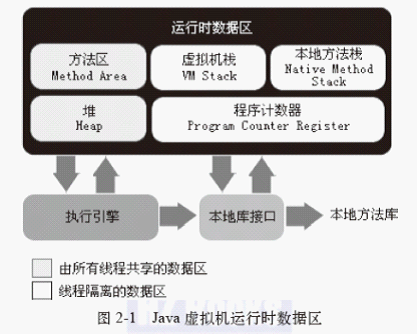

#深入理解Java虚拟机

#第二部分：自动内存管理机制

##第二章：Java内存区域与内存溢出异常
+  JVM内存区域  

  +  程序计数器：类似x86 EIP，每个线程都有一个程序计数器；执行native代码时计数器值为空；唯一不会抛出OOM的区域；
  +  Java虚拟机栈：线程私有；即函数调用栈，保存函数局部变量；
  +  Native方法栈：执行Native代码的函数调用栈；
  +  Java堆：新创建的对象存放区域；
  +  方法区：保存已加载的类信息、常量、静态变量、即时编译器编译后的代码等数据；有以永久代实现此区域的，也有以独立GC实现的；
  +  运行时常量池：是方法区的一部分；`String.intern()`方法有可能对此区域造成大的影响（依赖于JVM实现）；
  +  直接内存：NIO模块，为了提高内存访问效率，直接分配堆外内存，直接操作；
+  HotSpot虚拟机对象创建  
首先检查类的符号引用是否在常量池中，并检查该类是否已加载、解析、初始化；如果没有，则先进行加载；  
然后为对象分配内存空间，对象所占空间在类加载完成后即可确定；  
堆内存管理大致有两种方式：指针碰撞；空闲列表。依赖于GC时是否会对回收的内存进行压缩整理；  
分配内存的同步性保证：分配过程原子化；将内存分配按照线程划分在不同的空间中（本地线程分配缓冲，TLAB）。后者可通过JVM参数控制；  
内存分配完后，将内存空间初始化为零值，不包括“对象头”，初始化工作可以提前至TLAB分配时进行；  
设置“对象头”，例如：对象是哪个类的实例，类的元数据信息地址，对象hash值，GC分代年龄等信息；根据虚拟机当前的运行状态不同，是否启用偏向锁等，对象头会有不同设置方式；  
执行类的&lt;init&gt;方法；
+  HotSpot虚拟机对象的内存布局  
分为三部分：Header，实例数据，对其填充；  
实例数据部分，相同宽度的字段会分配到一起；满足该前提下，父类的变量出现在子类前；CompactFields参数为true时，子类中较窄的变量可能会插入到父类变量的空隙之中；  
对象大小8字节对其；
+  对象的访问定位  
在堆上建立了对象，使用的时候基本都是通过栈上的reference来操作堆上的对象；  
目前主流有两种访问方式：使用句柄；直接指针；
  +  使用句柄  
  在堆上划分一块内存作为句柄池，reference指向的是对象的句柄地址，句柄中包含了对象实例数据与类型数据各自的具体地址信息；句柄地址是稳定的，对象移动时只需修改句柄的内容，不必修改reference；
  +  直接指针  
  reference直接指向堆上对象地址；访问速度快，只需一次指针定位；HotSpot使用直接指针方式；
+  各种可能的OutOfMemoryError异常
  +  堆溢出  
  ```java
  java.lang.OutOfMemoryError: Java heap space...
  ```
  log中明确指出heap space，可通过JVM参数设置堆大小、最大大小、发生OOM后dump堆上数据；  
  一般通过分析dump数据，确认内存中的对象是否必要，即确定是内存泄漏还是内存溢出；  
  如果是内存泄漏，可进一步查看泄漏对象到GC Roots的引用链，根据引用链，基本就能定位泄漏代码的位置了；  
  如果是内存溢出，则可通过增加JVM堆内存、审查代码，减少对象生命周期，减少程序运行期间的内存消耗；
  +  虚拟机栈与本地方法栈溢出  
  StackOverFlowError，OutOfMemoryError  
  当每个线程分配的栈容量越大时，发生StackOverFlowError时创建的线程数越少，因为每个进程的内存是有限的，栈容量越大，则允许的线程数越少；通过减少线程数、更换64位虚拟机（增加内存）、减少最大堆和栈容量，均可缓解这一错误；
  +  方法区与运行时常量池溢出  
  ```java
  java.lang.OutOfMemoryError: PermGen space...
  ```
  永久代区域内存大小可以配置，如果方法区以永久代实现，则`String.intern()`方法就可能导致该错误；  
  类的卸载条件非常苛刻，如果运行时使用了大量的动态生成类，有可能导致该错误；
  +  直接内存溢出  
  ```java
  java.lang.OutOfMemoryError: ...
  ```
  在dump文件中看不出明显异常；  
  直接内存区域可以通过JVM参数配置，默认与堆最大值一样；