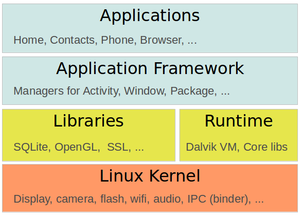

#[Android develop basics, based on Android 5.0](http://www.vogella.com/tutorials/Android/article.html)

##什么是Android
+  安卓系统架构图：  
  

  
##安卓开发工具
+  Android RunTime(ART)
  +  安卓5.0使用ART技术，在安装应用的时候，应用程序代码就被翻译为机器码，加快应用程序运行；
  +  将导致程序代码增大30%左右，但能加速运行、节约电量；
  +  `dex2oat`工具负责将.dex文件转换为ELF格式的文件，其中包含dex代码、native代码、meta-data等；
  +  ART中的垃圾回收也进行了优化，以加速应用程序的休眠与恢复；

+  从源码到安卓应用程序的过程
  +  Java编译器将java源码编译为`.class`文件；
  +  SDK中的`dx`工具将`.class`文件打包为`.dex`文件（Dalvik Executable），这一过程会对重复信息进行优化；
  +  `aapt`工具将`.dex`文件和资源文件（XML、图片等）打包为`.apk`文件（Android Package）；
  +  `adb`工具将`.apk`文件安装到设备上，并启动应用程序；
  
+  安全性：由Linux内核保证
  +  每个应用程序在底层系统中都有唯一的user和group id；
  +  应用程序的文件是私有的，只有对应的user才能访问；
  +  每个应用程序运行在独立的进程；