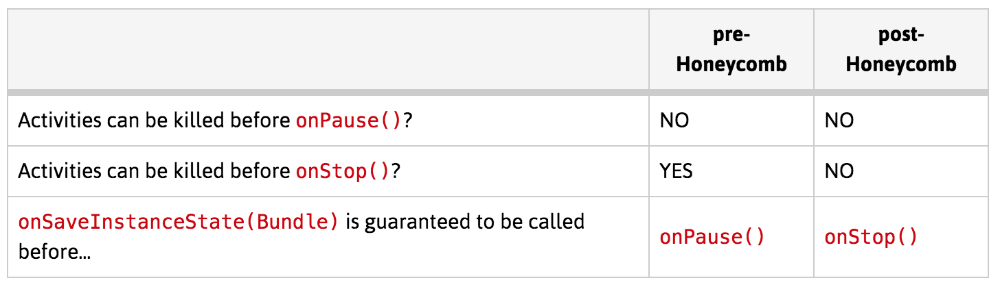

#[使用Fragment](http://www.vogella.com/tutorials/AndroidFragments/article.html)

##优点
+  简化对UI的重用，将UI和交互放到Fragment里面，可以方便的针对不同设备设置不同的UI（如pad显示两个fragment，phone显示一个）；

##完整生命周期


##使用fragment
+  直接在layout.xml里面声明一个Fragment
+  使用FragmentManager动态添加、替换、移除；
  +  必须通过FragmentTransaction来完成动态改变；
  +  addToBackStack()方法可以支持通过返回键回退到上一个Fragment；
+  Fragment的isInLayout()方法可以判断Fragment是否已经显示；
+  可以通过放在不同文件夹下（values，values-land等）的xml文件中的变量值，在代码中动态获取值，来达到判断当前运行模式/设备的目的；
+  Fragment的Transaction支持动画；

##使用Fragment进行后台处理（Headless Fragment）
+  onCreateView返回null；
+  结合`setRetainInstance()`方法，让Fragment在应用程序配置发生变化（横竖屏、屏幕尺寸）时，不会被destroy，从而继续执行后台任务；
+  通过为Fragment设置tag，可以在之后获取fragment实例；
+  效果类似于MVP中的ViewState；

##[Fragment不利于单元测试](https://corner.squareup.com/2014/10/advocating-against-android-fragments.html)
+  Fragment的life cycle很复杂
+  View controllers? Not so fast.  
操作view，有很多view相关的代码，不利于单元测试
+  Fragment transactions  
异步过程，当接收到多个click事件，或者configuration changes时，程序将处于未知状态
+  Fragment creation magic  
fragment manager可能会使用反射接口重新创建fragment，而fragment有可能会作为内部类被定义，没有public的构造函数，问题就来了
+  Fragments: lessons learned
  +  Single Activity Interface：使用不同的Fragment实现界面，动效、生命周期将变得更容易
  +  The backstack isn't an activity specific notion; you can implement a backstack within an activity.
  +  There is no need for new APIs; everything we needed was there from the very beginning: activities, views, and layout inflaters.
+  Responsive UI: fragments vs custom views
+  扩展阅读：使用custom views构建single activity app：[Simpler Android apps with Flow and Mortar](https://corner.squareup.com/2014/01/mortar-and-flow.html)

##[Fragment Transactions & Activity State Loss](http://www.androiddesignpatterns.com/2013/08/fragment-transaction-commit-state-loss.html)
```java
java.lang.IllegalStateException: Can not perform this action after onSaveInstanceState
    at android.support.v4.app.FragmentManagerImpl.checkStateLoss(FragmentManager.java:1341)
    at android.support.v4.app.FragmentManagerImpl.enqueueAction(FragmentManager.java:1352)
    at android.support.v4.app.BackStackRecord.commitInternal(BackStackRecord.java:595)
    at android.support.v4.app.BackStackRecord.commit(BackStackRecord.java:574)
```
+  原因：在activity的state被save之后，commit FragmentTransaction，会抛出这个异常
+  当activity在后台被杀死之后，会通过onSaveInstanceState回调让程序可以保存数据（状态），其中dialog, fragment, view的状态由framework负责保存和恢复
+  因为FragmentTransaction#commit()在onSaveInstanceState()后被调用了，系统为了防止activity state loss，抛出了该异常
+  从3.1起，安卓系统对于Activity生命周期的维护发生了变化  

support库的行为：    

+  如何避免
  +  Be careful when committing transactions inside Activity lifecycle methods  
  只在onCreate或者响应用户的输入时才会commit，不会遇到这个问题；但如果在onActivityResult、onStart、onResume等其他生命周期函数中调用，则会有风险，尤其是onResume，推荐使用FragmentActivity#onResumeFragments()/Activity#onPostResume()中调用，而不是onResume。  
  ```java
    private boolean mReturningWithResult = false;
    
    @Override
    protected void onActivityResult(int requestCode, int resultCode, Intent data) {
        super.onActivityResult(requestCode, resultCode, data);
        mReturningWithResult = true;
    }
    
    @Override
    protected void onPostResume() {
        super.onPostResume();
        if (mReturningWithResult) {
            // Commit your transactions here.
        }
        // Reset the boolean flag back to false for next time.
        mReturningWithResult = false;
    }
  ```
  +  Avoid performing transactions inside asynchronous callback methods.   
  回调内已经对Activity的状态没有保证了，强烈建议不要这么做；
  +  Use commitAllowingStateLoss() only as a last resort.