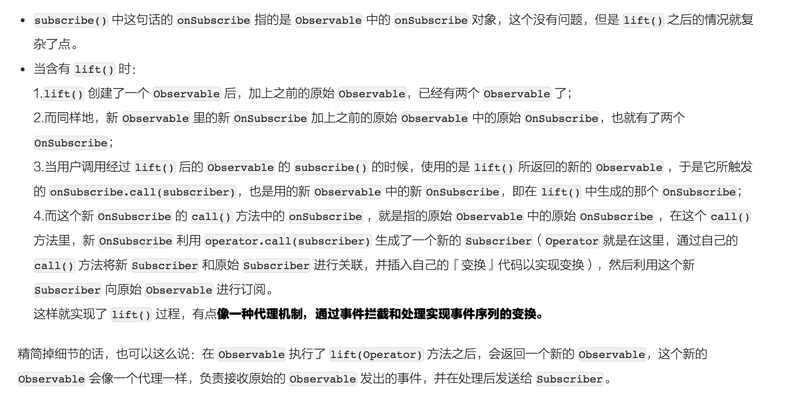

# Rx (Reactive eXtention)

四部分：事件流源头(source/observable)，对事件流的操作(operator/transformer)，对最终事件流进行响应(subscriber/observer)，以及整个过程的调度(scheduler)。

## 再看文档
+  The Observable Contract
  +  Notifications，observable与observer之间的通信包括：OnNext，OnCompleted，OnError，OnSubscribe；observer与observable之间的通信包括：Subscribe，Unsubscribe，Request；
  +  observable可能会触发零次或多次OnNext，每次发出一个item，最终可能会有一次OnCompleted或OnError，这两者不可能都被触发，这两者之一一旦触发，就再也不会有任何事件了；
  +  observable可能不会触发任何OnNext，也可能永远不会终止，也可能既不触发任何OnNext，也不终止；
  +  observable发出item必须是串行的，可以是在不同的线程中，但是item之间必须遵循某种顺序（串行）；
  +  如果observable并未触发OnCompleted/OnError，则observer仍可以和observable通信，即触发Unsubscribe/Request；但一旦observable已经终止了，observer就不应该再对observable发出任何指令了；
  +  OnError不能传null，必须提供一个合适的error；
  +  observable终止（释放资源）之前，必须向observer发出OnCompleted/OnError通知；
  +  observable可能在收到observer的Subscribe通知之后，立即开始OnNext；
  +  observer发出Unsubscribe后，observable会尝试停止向observer发出事件，但是并不保证！
  +  当observable发出OnCompleted/OnError之后，subscription就结束了，observer无需再Unsubscribe；
  +  当有多个observer先后subscribe同一个observable时，它们接收到的item序列没有保证，即可能从subscribe之后，始终相同，也可能会replay，甚至是没有任何关系；
  +  Backpressure，是可选的，并不是所有的（语言）实现都包含，即便包含，也可能只是部分实现；
  +  如果observable实现了Backpressure，且observer使用backpressure，则observer subscribe时，observable不会立即发出item，相反，它会向observer发出一个OnSubscribe通知；
  +  observer收到OnSubscribe通知后，可以向observable发出Request通知，主动请求一定数量的item；
  +  observable收到Request后，正常情况下会向observer发出对应数量的item，但是也可能会发出OnCompleted/OnError，甚至在observer发出Request之前就终止自己；
  +  如果observable不支持backpressure，则收到observer的Request时，应该触发OnError，并终止自己；
  +  如果observable产生item的速度超过observer Request的速度，则对多余的item的处理，取决于observable的策略，或丢弃，或保存排队，或者由observer配置策略；
+  Hot & Cold Observable
  +  observable合适开始发出item？
  +  hot：创建之后立即开始，后续的observer将只能开到subscribe之后的序列；
  +  cold：observer subscribe之后才开始，保证observer看到的是完整的序列；
  +  有的实现版本（语言）中，还存在Connectable的observable，它的开始时机既不是创建时，也不是被subscribe时，而是connect方法被调用时；
  +  注意：hot, cold, connectable和是否replay是两个概念，没有必然联系；此外，创建item的代码执行时机也是另外一个概念，它取决于代码的求值时机；
+  Operator，文档包含的是有哪些operator，以及如何选择operator，[详见文档](http://reactivex.io/documentation/operators.html)。
+  Single
  +  RxJava的特殊实现，只会发出一个item，或者OnError，所以subscribe时，只需提供onSuccess和onError即可；
  +  onSuccess和onError只有其中之一会被调用，且只会被调用一次；是否一定会有其中之一被调用？如果不考虑无限等待的话，可以说会；
+  Subject
  +  Subject是某些Rx实现版本的内容，它既是observable，也是observer
  +  作为observer，它可以subscribe到其他的observable，作为observable，它可以被其他observer subscribe，它所subscribe的observable发出的item，它将转发出去，而且它也可以自行发出item；
  +  如果observable是cold的，当subject subsrcibe这个observable时，它将开始发出item，因此用一个subject去subscribe cold observable，可以达到把cold变hot的效果（此时subject作为observable，就是hot的了）；
  +  AsyncSubject，只在源observable结束时，发出源observable发出的最后一个item，如果源observable没有发出任何item，则它也不会发出任何item；如果有多个observer subscribe它，它会始终发出同一item；如果源observable发生错误，它也将发出错误，不会发出任何item；
  +  BehaviorSubject，它被subscribe时，将会重放此前最后一个item（或者一个默认item）；如果subscribe发生在onError之后，那observer将只会收到onError；
  +  PublishSubject，不会重放；hot，创建之后就会开始发出item（如果有），所以可能会有item未被任何observer接收到；如果源observable已经终止（onCompleted/onError），则它对后续的observer只会发出相应的终止事件；
  +  ReplaySubject，会重放所有的item；有的版本中，当历史item过多，或者时间过长，它会丢弃老的item；使用ReplaySubject时，不能在多线程调用onNext/onCompleted/onError方法，否则会导致非串行，有悖于observable contract，导致无法确定重放顺序；
  +  [RxJava] SerializedSubject，可以把普通的subject转化为可以多线程调用onNext/onCompleted/onError的subject；
  +  [RxJava] TestSubject，TestScheduler，用于测试、调试；
+  [Relay](https://github.com/JakeWharton/RxRelay)
  +  使用Subject可以把已有非Rx API适配为Rx API，但是一旦subject终止之后，就必须重新创建一个subject才能继续接受item了；
  +  Relay和Subject类似，但是不会终止，它继承自Observable，实现了Action1（而不是Observer）；

## 原理
+  `subscribe`原理，引用自[给 Android 开发者的 RxJava 详解](http://gank.io/post/560e15be2dca930e00da1083#toc_10)

注意，选中的部分，应该是`subscribe()`而不是`subscriber()`。

+  `lift`变换原理，引用自[给 Android 开发者的 RxJava 详解](http://gank.io/post/560e15be2dca930e00da1083#toc_19)

+  `subscribeOn`和`observeOn`原理：也是用`lift`实现，通过相应`Operator`实现线程的切换

## 细节
+  just, from等操作均是在创建时执行，而非subscribe时，很显然，因为java函数调用传递的是值，所以会先eval；create, defer等操作均是在subscribe时执行；~~create多次subscribe只会执行一次，defer多次subscribe会执行多次~~（create、defer，call函数内的代码每次subscribe均会被执行）；[ref](https://github.com/Piasy/TestUnderstandRx/blob/242821254f/app%2Fsrc%2Ftest%2Fjava%2Fcom%2Fgithub%2Fpiasy%2Ftestunderstand%2Frx%2FHotColdObservableTest.java#L110)
+  hot v.s. cold Observable
  +  cold：当Observable被subscribe时才开始发射item；（后来的subscriber同样会收到其subscribe之前发射的item；retrofit实现的是cold；每次subscribe时，发射item的代码都会被执行）
  +  hot：创建之后就会开始发射item，不管是否被subscribe；（后来的subscriber不会收到其subscribe之前发射的item；）
+  map v.s. flatMap
+  将cold observable通过cache转换成hot之后，再在别处subscribe他们，有其应用场景：第一次subscribe时并不关心结果，但是后面某处想要获取结果，又不希望再次执行创建observable的过程；类似于预取思想；
+  怎么感觉有问题。。。
+  concat v.s. merge：concat不会让参数observable发射的item之间重叠，而merge可能会；concat传入的参数顺序是有影响的，merge没影响；
+  share v.s. replay
  +  replay
    +  需要调用connect方法后，observable才开始发射；
    +  后subscribe的subscriber会在subscribe的瞬间先收到其subscribe之前发射的所有item，然后再正常收到剩下的item；
    +  subscriber unsubscribe后将不会再接收到item，但也不会有onCompleted事件，且对其他subscriber不影响；
  +  实现的功能都需要测试验证，不能凭经验、也不能看博客，也不能仅看文档；

## [应用场景](http://blog.csdn.net/theone10211024/article/details/50435325)
+  Scheduler线程切换
+  Retrofit结合RxJava做网络请求框架
+  RxJava代替EventBus进行数据传递：RxBus
+  解决嵌套回调（callback hell）问题
+  RxJava进行数组、list的遍历
+  使用debounce做textSearch
+  使用interval做周期性操作。当有“每隔xx秒后执行yy操作”类似的需求的时候，想到使用interval
+  使用timer做定时操作。当有“x秒后执行y操作”类似的需求的时候，想到使用timer
+  使用merge合并两个数据源
+  使用combineLatest合并最近N个结点
  +  还存在另一个类似的operator：withLatestFrom，他们的使用场景区分如下（[摘自](http://staltz.com/rx-glitches-arent-actually-a-problem.html)）：
  +  If I want to combine Observables that seem completely independent to each other, then I need combineLatest.
  +  If I want to just map a certain Observable while using information from other Observables, then I need withLatestFrom.
+  使用concat和first做缓存
+  使用throttleFirst防止按钮重复点击
+  使用schedulePeriodically做轮询请求
+  使用timeInterval，获取本次事件与上次事件之间的时间间隔
+  响应式的界面

## Code review
+  [part I](http://artemzin.com/blog/rxjava-code-review-part-1)