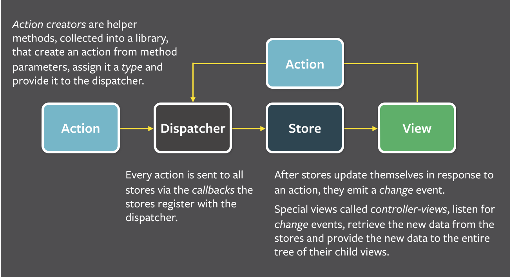

# Flux基础

## 组件
+  Dispatcher
+  Store
  +  Cache data
  +  Expose public getters to access data (never have public setters)
  +  Respond to specific actions from the dispatcher
  +  Always emit a change when their data changes
  +  Only emit changes during a dispatch
+  View
  +  Are react components that are controlled by a container
  +  Have all of the UI and rendering logic
  +  Receive all information and callbacks as props
+  Container
  +  Are react components that control a view
  +  Primary job is to gather information from stores and save it in their state
  +  Have no props and no UI logic
+  Action
  +  Describe a user's action, are not setters. (e.g. `select-page` not `set-page-id`)