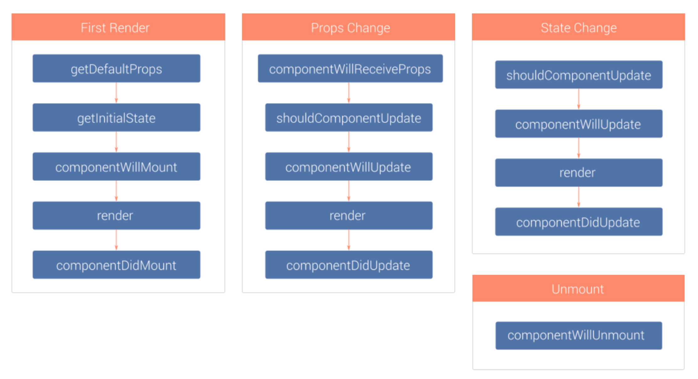

# React基础

## [React设计哲学](http://www.infoq.com/cn/articles/react-art-of-simplity/)
+  编写可预测，符合习惯的代码：代码简单易懂，易于维护
+  使用JSX直观的定义用户界面：传统方式，即便V与M文件分离，其逻辑依然是紧密关联的，所以干脆将它们文件上放到一起
+  简化的组件模型：所谓组件，其实就是状态机器；除了状态，组件还有属性；UI与状态绝对一致，修改UI仅仅修改状态即可；
+  每一次界面变化都是整体刷新：简化UI更新逻辑，由framework负责实际高效局部刷新；
+  单向数据流动：Flux，永远只有从模型到视图的数据流动
+  让数据模型也变简单：Immutability
+  React思想的衍生：React Native, React Canvas等等

## [React开发神器Webpack](http://www.infoq.com/cn/articles/react-and-webpack)
+  同时支持CommonJS和AMD模块
+  串联式模块加载器以及插件机制，让其具有更好的灵活性和扩展性
+  可以基于配置或者智能分析打包成多个文件，实现公共模块或者按需加载
+  支持对CSS，图片等资源进行打包，从而无需借助Grunt或Gulp
+  开发时在内存中完成打包，性能更快，完全可以支持开发过程的实时打包需求
+  对sourcemap有很好的支持，易于调试

## [理解JSX和组件](http://www.infoq.com/cn/articles/react-jsx-and-component)
+  JSX本身并不是什么高深的技术，可以说只是一个比较高级但很直观的语法糖
+  这种使用代码构建界面的方式，完全消除了业务逻辑和界面元素之间的隔阂，让代码更加直观和易于维护
+  JSX本身就和XML语法类似，可以定义属性以及子元素，唯一特殊的是可以用大括号来加入JavaScript表达式
+  React使用组件来封装界面模块，整个界面就是一个大组件，开发过程就是不断优化和拆分界面组件、构造整个组件树的过程
+  组件的`props`与`state`，前者类似于函数调用的参数，后者类似于函数内部的局部变量
+  组件内部不应该修改`props`，组件外部也无法修改`state`，`props`表示那些一旦定义，就不再改变的特性，而`state`是会随着用户互动而产生变化的特性
+  组件生命周期函数



+  `this.props.children`与`React.Children`，前者包括所有的属性，后者是react的一个API，处理了不同的情形，使得需要使用前者时不用考虑各种情况
+  使用`propTypes`来限定属性的类型，使用`getDefaultProps`来设置属性的默认值，例如：

```javascript
var MyTitle = React.createClass({
  propTypes: {
    title: React.PropTypes.string.isRequired,
  },
  
  getDefaultProps : function () {
    return {
      title : 'Hello World'
    };
  },

  render: function() {
     return <h1> {this.props.title} </h1>;
   }
});
```

+  使用`ref`属性，获取真实DOM节点，必须等到虚拟 DOM 插入文档以后，才能使用这个属性：

```javascript
var MyComponent = React.createClass({
  handleClick: function() {
    this.refs.myTextInput.focus();
  },
  render: function() {
    return (
      <div>
        <input type="text" ref="myTextInput" />
        <input type="button" value="Focus the text input" onClick={this.handleClick} />
      </div>
    );
  }
});
```

+  用户在表单填入的内容，属于用户跟组件的互动，所以不能用`this.props`读取，可以通过设置事件回调响应输入变化
+  组件的数据来源，通常是通过 Ajax 请求从服务器获取，可以使用 componentDidMount 方法设置 Ajax 请求，等到请求成功，再用 this.setState 方法重新渲染 UI
